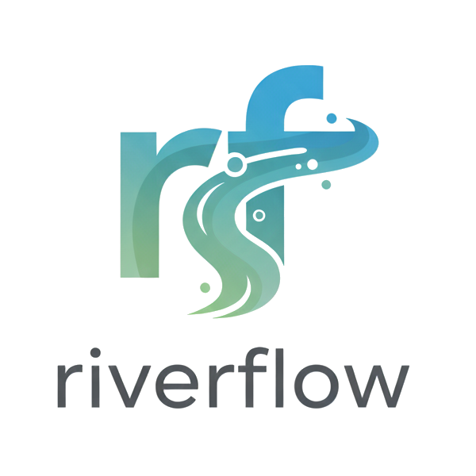

# Riverflow



A lightweight, Python-native workflow orchestration library for defining, scheduling, and monitoring directed acyclic graphs (DAGs) of tasks.

## Installation

```bash
pip install Riverflow
```

## Why Riverflow?

Riverflow is designed as a **lightweight alternative to Apache Airflow** for teams that need workflow orchestration without the operational overhead of distributed systems.

### When to Choose Riverflow

- **Single-host deployments**: Run workflows directly on your server without Kubernetes, Docker clusters, or separate worker nodes
- **Embedded workflows**: Integrate orchestration directly into your applications
- **Development & prototyping**: Quick setup without complex infrastructure requirements  
- **Resource-constrained environments**: Minimal memory and CPU footprint
- **Simple operations**: No external databases, message queues, or worker management needed

### Core Airflow Features in Riverflow

✅ **DAG Definition** - Directed acyclic graphs with dependencies  
✅ **Scheduling** - Cron and interval-based execution  
✅ **Task Dependencies** - Upstream/downstream relationships  
✅ **Retry Logic** - Configurable retry policies  
✅ **Real-time Monitoring** - WebSocket-based live updates  
✅ **Task States** - Success, failure, timeout, skipped handling  

**Perfect for**: Data pipelines, ETL jobs, application workflows, CI/CD tasks, and any automation that fits on a single machine.

## Quick Start

```python
from riverflow.core import DAG, Task, Riverflow
from datetime import timedelta

# Define a DAG with context manager for task definition
with DAG(
    dag_id="data_pipeline",
    schedule=timedelta(hours=1)
) as dag:
    
    @dag.task("extract_data")
    async def extract():
        print("Extracting data...")
        # Your extraction logic here
    
    @dag.task("transform_data")
    async def transform():
        print("Transforming data...")
        # Your transformation logic here
    
    @dag.task("transform_data")
    async def load_data():
        print("Loading data...")
        # Your loading logic here
    
    # Set dependencies using >> operator
    extract >> transform >> load

# Execute
riverflow = Riverflow()
riverflow.register_dag(dag)
riverflow.start()
```

## Core Components

### DAG (Directed Acyclic Graph)

- **Purpose**: Container for tasks with scheduling and dependency management
- **Key Features**: Schedule intervals, start dates, task dependency resolution

### Task

- **Purpose**: Individual unit of work within a DAG
- **Key Features**: Configurable operators, upstream/downstream dependencies, retry logic

### Riverflow Engine

- **Purpose**: Orchestration engine for DAG execution
- **Key Features**: Parallel execution, real-time monitoring, failure handling

### Task Definition

- **Decorator approach**: Use `@dag.task("task_id")` for clean task definition
- **Constructor approach**: Use `Task()` constructor for more control over task properties
- **Function-based**: All tasks are async functions that define your business logic

## Real-time Monitoring

Riverflow includes a FastAPI-based WebSocket server for live DAG monitoring:

```python
from Riverflow.server import setup_server

# Start monitoring server
app = setup_server(Riverflow_instance)
# Access at http://localhost:8000
```

## Architecture

- **Scheduler**: APScheduler-based task scheduling
- **Executor**: Multi-threaded task execution with dependency resolution  
- **Monitoring**: WebSocket-based real-time updates
- **Storage**: In-memory state with extensible backend support

## License

Apache License 2.0
